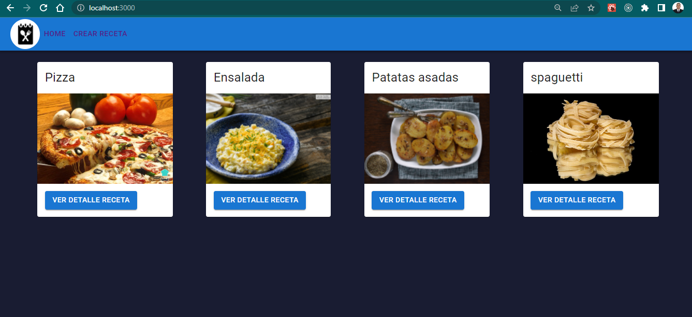
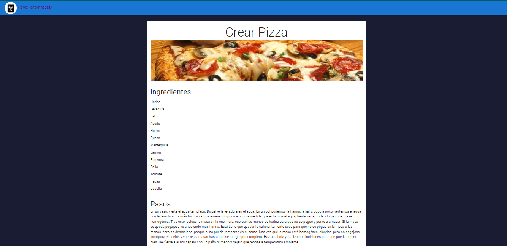
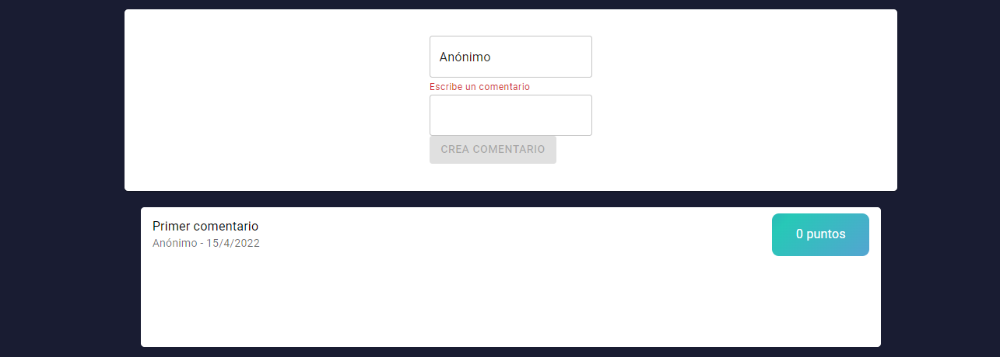
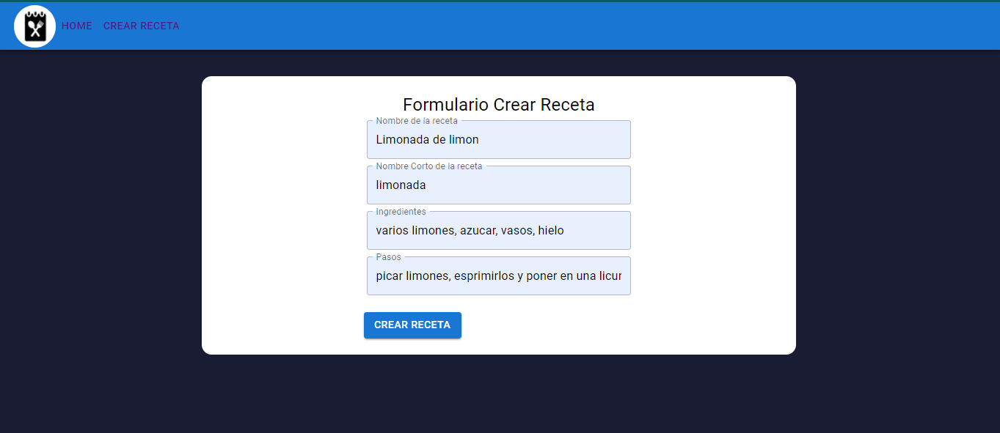
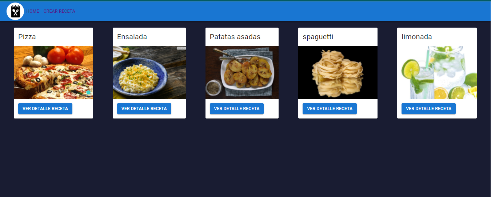

# Prueba Técnico || BlurEffect

### Notas

- Clone el proyecto en su máquina.
- Acceda a él desde su terminal
- Ejecute el comando `npm i`, así instalaremos todas las dependencias que necesita el proyecto.

### Presentación

## Home

## Detalle Receta

## Dettale Receta 1

## Detalle Receta 2

## Detalle Receta 3

## Crear nueva receta

## Home con la nueva card

